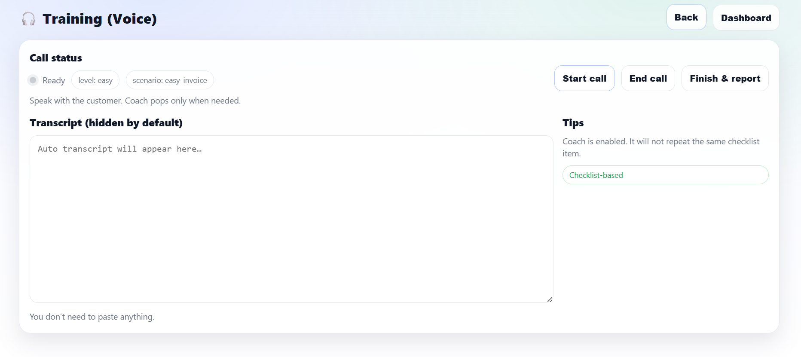

```markdown
# 🎧 CoachAI — Real-Time AI Coaching for Voice Calls

CoachAI is a real-time AI coaching system designed to support customer-service agents **during live voice calls**.  
It listens to conversations, transcribes speech, analyzes agent behavior, and provides **context-aware guidance and feedback** — without interrupting the call.

---

## ✨ Key Features

- 🎙 Live voice calls using WebRTC
- 📝 Real-time transcription (AssemblyAI)
- 🤖 AI coach with checklist-based guidance
- 📊 Post-call evaluation and report
- 🧠 LLM-powered reasoning (OpenAI / Mistral)
- 🌐 FastAPI backend with WebSockets

---
<p align="center">
 
</p>

<p align="center">
  <em>Real-time coaching interface with live transcription and checklist-based guidance</em>
</p>

## 🧩 System Architecture

```

Browser (Mic + WebRTC)
↓
FastAPI Backend (Railway)
↓
AssemblyAI (Live Transcription)
↓
LLM (Coaching + Evaluation)
↓
Real-time tips + Final Report

```

---

## 🚀 Live Demo

Backend URL:coachai-production-48cf.up.railway.app
```

[coachai-production-48cf.up.railway.app](coachai-production-48cf.up.railway.app)<id>.up.railway.app

```


---

## 🛠 Tech Stack

- Python 3.11
- FastAPI
- Uvicorn
- WebSockets
- WebRTC
- AssemblyAI
- OpenAI / Mistral
- Jinja2
- Railway

---

## 📦 Requirements

```txt
fastapi
uvicorn[standard]
python-dotenv
assemblyai
mistralai
jinja2
pydantic
websockets
itsdangerous
````

---

## ⚙️ Local Setup

### Clone the repository

```bash
git clone https://github.com/SoaadHamood/coachAI.git
cd coachAI
```

### Create a virtual environment

```bash
python -m venv venv
source venv/bin/activate  # Windows: venv\Scripts\activate
```

### Install dependencies

```bash
pip install -r requirements.txt
```

### Create `.env` (local only)

```env
OPENAI_API_KEY=sk-...
ASSEMBLYAI_API_KEY=...
```

⚠️ Do not commit this file.

### Run the app

```bash
uvicorn app:app --reload
```

Open:

```
http://127.0.0.1:8000
http://127.0.0.1:8000/docs
```

---

## ☁️ Deployment (Railway)

This project requires a persistent server (WebSockets + live audio).

### Start command:

```bash
uvicorn app:app --host 0.0.0.0 --port $PORT
```

### Environment variables (Railway → Service → Variables):

* OPENAI_API_KEY
* ASSEMBLYAI_API_KEY

---

## 🔐 Environment Variables

| Name               | Description                     |
| ------------------ | ------------------------------- |
| OPENAI_API_KEY     | LLM for coaching and evaluation |
| ASSEMBLYAI_API_KEY | Live speech transcription       |

They are accessed via:

```python
import os
os.getenv("OPENAI_API_KEY")
```

---

## 🧠 AI Logic

* Checklist-based coaching
* Context-aware suggestions
* No repetition of advice during calls
* Final post-call evaluation

---

## 🧪 Known Limitations

* Cold starts on free tiers
* Requires browser microphone permissions
* Prototype-scale deployment

---

## 📌 Future Improvements

* Agent performance dashboard
* Multi-agent simulation
* Multilingual support
* Persistent analytics

---

## 👩‍💻 Author

Soaad Hamood
GitHub: [https://github.com/SoaadHamood](https://github.com/SoaadHamood)

---

## 📄 License

MIT License

```


